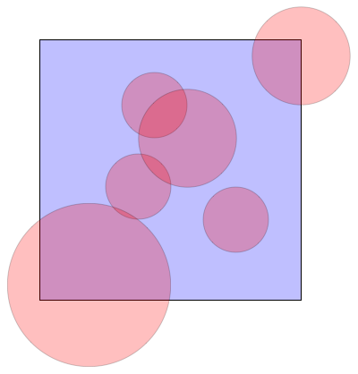

====================================
BabelDix: ten languages in ten weeks
====================================

Install the challenge server from github using::

	git clone https://github.com/dkirkby/babeldix.git

To update to the latest version of the server after your initial installation, use::

	cd babeldix
	git pull

When you are ready to take a challenge, start the server::

	cd babeldix
	python server.py

Finally, run your program from a different command-line to keep its output seperate from the server messages.  You can do the challenges in any order and do not need to re-start the server between challenges.

This is free software, available under an MIT license.

-------------
The Languages
-------------

Spend one week on each of the following languages:

* week 1: python

For each language, keep notes on your blog including:

* How you installed the language on your computer.
* What web pages you found useful for learning the language.
* What web pages you found useful as references.
* Your impressions of the advantages and disadvantages of the language.
* Your notes on how you solved each challenge.

Create a github repo for your challenge code. Put the code for each language into its own directory.

----------------
Challenge Format
----------------

All challenges require that you use a TCP socket to connect to the server.  Since the server is running on your computer, you can use the hostname `localhost`.  The port number should be `1234`.

All communication with the server uses ASCII text.  Each message consists of a sequence of printable characters (except newline) followed by a newline character.  Note that you many need to read from your socket several times to assemble a complete message, ending with a newline character.

The text of each message is always valid `JSON <http://json.org>`_, so you can either use one of the many JSON libraries available or else, since the format is simple enough, parse the message text yourself.

All challenges consist of the following phases:

1. Your program sends the name of challenge you wish to attempt as a string, e.g. ``"histogram"``.
2. The server responds with the challenge data (or ``"error"`` if the name is not recognized).
3. Your program send the challenge solution.
4. The server responds with either ``"yes"``, if your solution is correct, or else ``"no"``.

If you are having trouble communicating with the server, check the server log messages for useful diagnostics.  You can also check the server log to see how much time your program used to calculate the solution.

The available challenges are described below.

Hello Challenge
---------------

This is the easiest challenge, and just requires that you are able to open a socket and perform basic communication with the server. Send the name ``"hello"`` to begin this challenge.  The server responds with ``"hello"``.  You answer ``"goodbye"``.

Histogram Challenge
-------------------

In this challenge, you build a histogram of positive integer values provided by the server. Send the name ``"histogram"`` to begin this challenge.  The server responds with a message like::

	[[10,3],[26,0,1,21,22,11,21,19,3,12,20,24,26,6,27,9,16,9,5,22,21,7,16,7,5,11,8,4,4,5,8,15,2,0,25,8,1,15,9,17,29,19,25,11,0,28,25,10,23,10,7,7,27,11,12,27,3,12,7,8,8,23,18,4,12,5,1,16,12,16,10,16,13,27,13,6,27,14,15,7,0,26,16,26,3,27,26,7,23,10,24,27,7,28,9,16,26,18,23,13]]

The square brackets ``[...]`` in this message identify JSON arrays, so this message consists of an array of two arrays.  The first array `[10,3]` describes the histogram you need to build: it has 10 bins, with 3 consecutive integers falling into each bin::

	bin-0: 0,1,2
	bin-1: 3,4,5
	bin-2: 6,7,8
	...
	bin-8: 24,25,26
	bin-9: 27,28,29

Your challenge is to count how many values in the second array ``[26,0,1,...,23,13]`` fall into each bin and then return these counts.  The correct answer in this case is ``[8,10,15,12,9,11,5,9,11,10]``, which means that there are 8 values equal to 0, 1, or 2 (bin-0), 10 values equal to 3, 4, or 5 (bin-1), etc.

Circles Challenge
-----------------

In this challenge, you estimate the area of some random overlapping circles within a square using floating point arithmetic. Send the name ``"circles"`` to begin this challenge.  The server responds with a message like::

	[[0.375,0.4375,0.125],[0.75,0.3125,0.125],[1.0,0.9375,0.1875],[0.4375,0.75,0.125],[0.1875,0.0625,0.3125],[0.5625,0.625,0.1875]]

This is an array of 6 circles, where ``[0.375,0.4375,0.125]`` represents the first circle, and so on. The three numbers for each circle are the (xc,yc) coordinates of the circle's center and its radius. The picture below shows the six circles for this example:

The challenge here is to estimate the area of the blue rectangle that is not covered up by any circles.  The bottom-left and upper-right corners of the blue square are at coordinates (0,0) and (1,1). There are different ways to approach this problem, but a good way to get started is using a "Monte Carlo" method, which simulates throwing random darts at the square and measuring what fraction do not hit any circles:

1. Generate a random x and y for the dart uniformly between 0 and 1.
2. Loop over each circle's ``(xc,yc)`` and `r`` values.
3. Calculate the square of the distance between the dart and the circle's center as ``(x-xc)**2 + (y-yc)**2``
4. If this squared distance is less than ``r**2``, then the dart misses this circle.

Since the total area of the square is one, your answer should always be between zero and one. Since your answer only needs to be within 0.01 of the correct answer, you do not need to use more than four decimal places when sending your answer.
